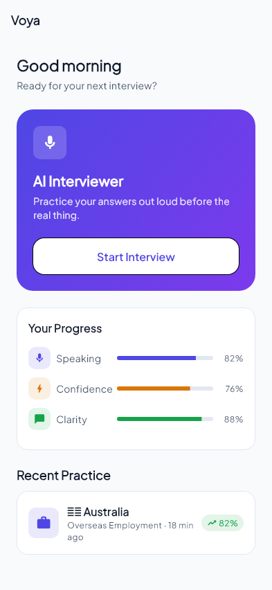
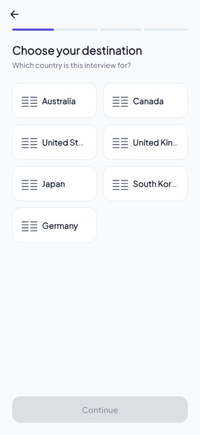
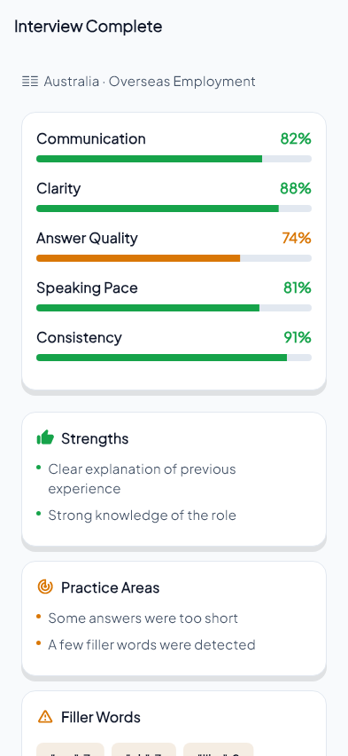
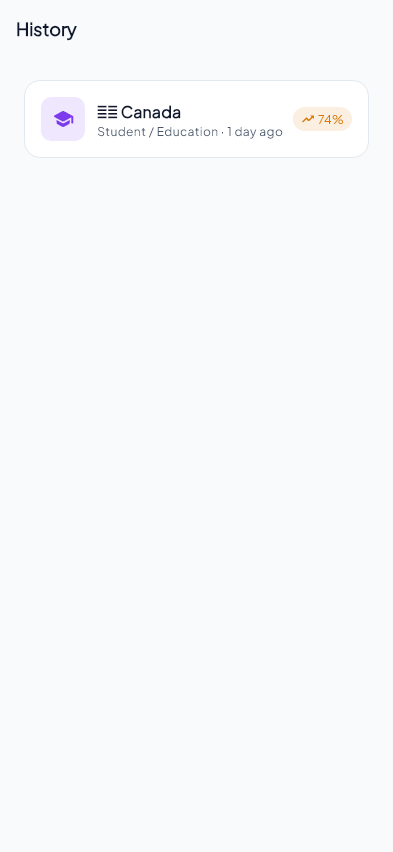
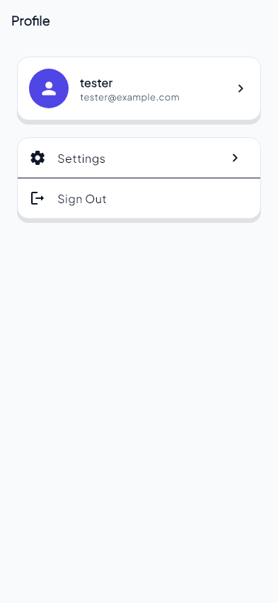
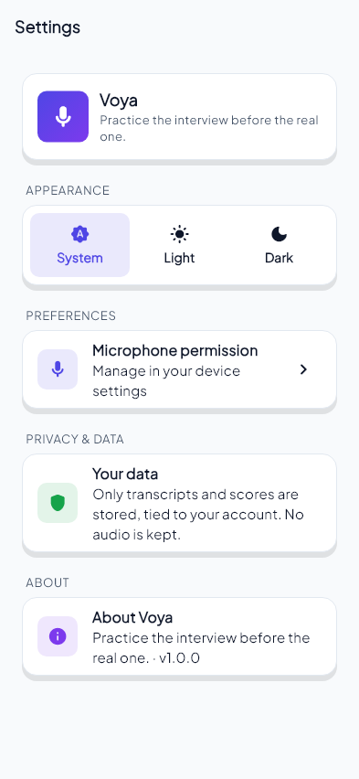

<p align="center">
  
</p>

<h1 align="center">Voya</h1>
<p align="center"><em>Practice the interview before the real one.</em></p>

<p align="center">
  
  
  
  
  
</p>

An AI-powered voice interview simulator. Users speak their answers out loud
to an animated AI interviewer and get realistic, adaptive follow-up
questions — not a chat-with-a-bot experience.

---

## Installation

### 1. Install Flutter

| Platform | Command |
|---|---|
| macOS | `brew install --cask flutter` |
| Windows | `winget install --id=Google.Flutter` |
| Linux / manual | Download from [flutter.dev/get-started/install](https://flutter.dev/get-started/install) |

Verify the install:

```bash
flutter --version   # this project targets Flutter 3.35+ / Dart 3.13+
flutter doctor       # resolve any red ✗ items before continuing
```

### 2. Clone the repo

```bash
git clone <this-repo-url>
cd voya
```

### 3. Install dependencies

```bash
flutter pub get
```

### 4. Run it

```bash
flutter devices      # confirm a device/emulator/simulator is attached
flutter run
```

First launch will prompt for microphone permission — this is required, the
whole app is voice-first.

### 5. (Optional) run checks

```bash
dart format --output=none --set-exit-if-changed .
flutter analyze
flutter test
```

These same checks (plus a debug Android build) run automatically in
[CI](.github/workflows/ci.yml) on every push and pull request to `main`.

---

## Description

Voya simulates a real spoken interview: the AI interviewer asks a
question out loud, an animated 2D avatar speaks it, the app listens to your
answer, transcribes it, and the AI decides whether to follow up, challenge a
vague answer, or move on — the same way a real interviewer would. Built for
practicing job, visa, immigration, and general interviews across different
countries, purposes, and difficulty levels.

---

## Screenshots

<table>
  <tr>
    <td align="center"><br/>Home</td>
    <td align="center"><br/>Interview Setup</td>
    <td align="center"><br/>Interview Result</td>
  </tr>
  <tr>
    <td align="center"><br/>History</td>
    <td align="center"><br/>Profile</td>
    <td align="center"><br/>Settings</td>
  </tr>
</table>

*Rendered directly from the real app widgets (each screen's `*_template_preview.dart` fixture), not mockups. The live voice interview screen itself isn't pictured here since its animated Rive avatar needs a real device/emulator to render.*

---

## Architecture

Clean Architecture, one-way dependencies: **Presentation → Domain → Data**.

```
config/         theming, routing — no business logic
core/domain/    entities + abstract service/repository interfaces
core/data/      concrete implementations (mock AI, on-device STT/TTS, local storage)
core/presentation/  bloc, screens, templates, atoms/molecules/organisms widgets
```

Key decisions:

- **State management:** `flutter_bloc`. The interview is a real state machine
  (idle → AI speaking → listening → analyzing → next question → …), which
  maps naturally onto bloc events/states.
- **Swappable AI/voice providers:** `AIInterviewService`, `SpeechToTextService`,
  and `TextToSpeechService` are domain interfaces. The current AI is a local,
  rule-based `MockAIInterviewService` (no API key required) — a real LLM
  backend can replace it without touching the bloc or any screen.
- **Avatar:** a Rive character (`assets/rive/voya-character.riv`) driven by a
  small `AiAvatarController` (idle / thinking / speaking / listening /
  processing), isolated from business logic behind that same controller.
- **Screens split three ways:** `*_screen.dart` (logic, navigation, dialogs),
  `*_template.dart` (pure layout, data + callbacks in, no logic), and
  `*_template_preview.dart` (a fixture-data harness for viewing a template in
  isolation).

## System Design

The core loop the whole app is built around:

```
 AI speaks (TTS)
      │
      ▼
 Avatar animates (lip-sync driven by TTS amplitude)
      │
      ▼
 App listens (on-device STT, live waveform)
      │
      ▼
 User speaks → transcript
      │
      ▼
 AI analyzes the answer (vague? inconsistent? needs a follow-up?)
      │
      ├── follow-up needed → ask clarifying question ──┐
      │                                                 │
      └── move to next planned question ────────────────┤
                                                          ▼
                                                   repeat until time/
                                                   question limit hit
                                                          │
                                                          ▼
                                                 generate feedback,
                                                 save session + result
```

State lives in one place (`InterviewBloc`); everything else — the avatar, the
waveform, the transcript sheet — just renders whatever that state currently
is. Only text (transcripts, scores) is persisted locally via
`SharedPreferences`; no raw audio is stored.

## File Structure

```
lib/
├── main.dart
├── app.dart
├── config/
│   ├── constant/        # AppColors, AppTypography, AppSpacing, AppTheme, AppConstants
│   └── routes/          # app_router.dart, app_shell.dart — all navigation
└── core/
    ├── domain/
    │   ├── interview_setup/entities/
    │   ├── interview/entities|services|repositories/
    │   └── interview_results/entities/
    ├── data/
    │   ├── services/     # mock AI, STT/TTS impls, question bank, answer builder
    │   └── repositories/ # interview_repository_impl.dart (SharedPreferences)
    └── presentation/
        ├── bloc/interview/           # InterviewBloc, events, states
        ├── types/                    # UI-only navigation payloads
        ├── screen/<area>/            # logic-only screens
        └── widget/
            ├── atoms/                # md_primary_button.dart → MdPrimaryButton
            ├── molecules/            # md_card.dart, selectors, result cards…
            ├── organisms/            # md_ai_avatar.dart, transcript sheet
            └── templates/<area>/     # pure-layout template + preview per screen
assets/
├── icon/         # app_icon.png (master), app_icon_foreground.png (Android adaptive)
└── rive/         # voya-character.riv
```

**Naming:** files `snake_case.dart`, classes `PascalCase`, screens
`<name>_screen.dart`, templates `<name>_template.dart` (+ `_preview`), shared
widgets `md_<name>.dart` → `Md<Name>`.

## Versioning

Follows [Semantic Versioning](https://semver.org) (`MAJOR.MINOR.PATCH`) as
set in `pubspec.yaml`'s `version:` field, e.g. `1.0.0+1` — the `+1` is the
build number bumped on every release, independent of the semver part.

| Change | Bump |
|---|---|
| Breaking change to a public API/behavior | MAJOR |
| New feature, backwards-compatible | MINOR |
| Bug fix, no behavior change | PATCH |
